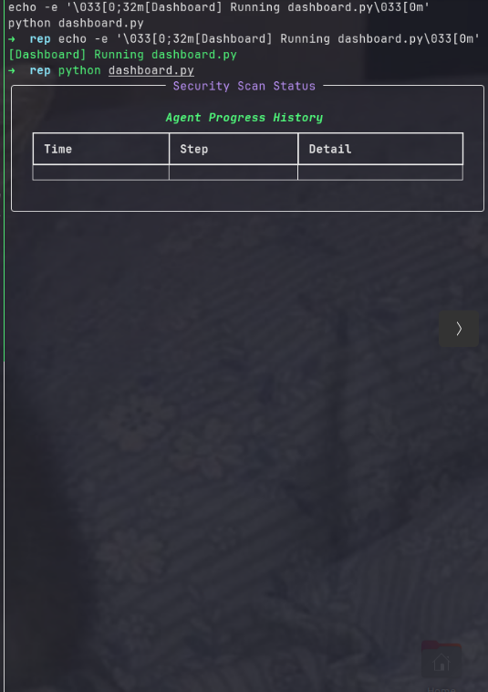

# MINERVA: XSS Vulnerability Detection and Verification System

**Developed at IIT Bhilai**  
This project implements a 3-stage autonomous system for detecting and verifying Cross-Site Scripting (XSS) vulnerabilities. It is built on top of the YURASCANNER research framework and integrates advanced LLM agents, DOM parsing, visual exploit confirmation, and runtime monitoring.

---


## Overview

This system automates the end-to-end process of XSS vulnerability scanning and validation using a multi-agent architecture. The process involves:

- DOM extraction and input vector identification  
- Payload injection and response handling  
- Visual confirmation of exploit success using image captioning  
- Real-time monitoring and diagnostics  

**Architecture Diagram**  

---

## Key Features

- **LangGraph Multi-Agent Pipelines**: Built on Groq-hosted **LLaMA 3.3 70B**, enabling intelligent crawling, payload crafting, and exploit reasoning.  
- **DOM Analysis**: Conducted using **BeautifulSoup** to identify interactive elements (buttons , forms , links).  
- **Visual Validation**: Uses ***LLaVA OneVision** multimodal model to analyze screenshots for exploit effects.  
- **Real-Time Monitoring**: Implemented with **FastAPI**, `Rich`, and terminal dashboard tools.  
- **Automation**: Shell-based orchestration using `tmux` for robust multi-process execution.  

---

## System Components & Execution

### 1. Status Server (Monitoring Backend)

Launch the FastAPI-based server:

```bash
fastapi run status_server.py
````

---

### 2. Terminal Dashboard (Runtime Visualization)

Start the terminal dashboard interface:

```bash
python dashboard.py
```



---

### 3. Flask Demo Application (Test Target)

This is the vulnerable test web application used for exploit demonstration:

```bash
python flask_demo_app/app.py
```


---

### 4. Main Execution Pipeline

Run the main control and orchestration logic (LangGraph + agent logic):

```bash
python Minerva.py
```


---

## ✅ XSS-Injected Page Display

After successful injection, the system captures a screenshot of the rendered DOM showing the injected payload:


> *Above: Injected payload results in a visible DOM alert, confirming successful XSS execution.*

These screenshots are processed using the `XSSAnalyzer` class, which uses the **LLaVA OneVision** multimodal model for captioning and reasoning about visual XSS effects.


## Dependencies

* Python 3.10+
* `fastapi`, `uvicorn`, `beautifulsoup4`, `tmux`, `Rich`, `Flask`, `LangGraph`, and `Salesforce BLIP` dependencies

Install all dependencies with:

```bash
pip install -r requirements.txt
```

---

## License

This project is intended for research and academic use. For permissions or collaborations, contact \[[manodeepray1](mailto:manodeepray1@gmail.com)].gmail

---

